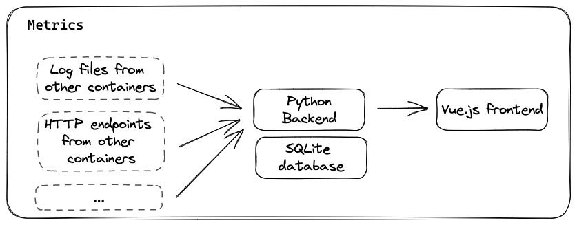

Metrics
=======

The `metrics` subsystem is responsible to transform raw data (e.g. web server logs) available on the offspot into business-oriented KPIs displayed on web dashboards.

The whole system is runing locally on the offspot. Dashboards are hence only presenting local offspot data.

At some point in the future, the system is meant to centralize data in a Cloud for aggregating multiple offspots. An intermediate data format is hence present, between raw data and KPIs.

## High-level overview

Filebeat (from Elasticsearch) is used to process the various inputs easily (read rotating log files nicely, poll a webserver with some stats, ...) and forwards these events to the backend server.

Filebeat has been chosen because it is assumed to be lightweight, already capable to handle complex situation like keeping a pointer to last log data read in a file, or also detect and handle nicely log files rotation. The OSS edition is used (i.e. we do not depend on the Elastic Licence, but only Apache License version 2.0).

The backend server is responsible to start Filebeat and watch events (in JSON) sent by Filebeat through its standard output STDOUT. If the Filebeat process is stopped (crash, ...), the backend server will try to restart it every 10 seconds. When the backend server starts, it also kills any left-over Filebeat process which might already be running.

The backend server is responsible to process the raw logs received from Filebeat and transform them into inputs to compute indicator records.

On-the-fly, every indicator has a current state used to store intermediate computations that will be needed to create the final record value. This state is updated at each event.

Indicator states are kept in memory. They are transfered to the SQLite database every minute (this is mandatory since it is quite common that the offspot is not shutdown properly).

The backend is also capable to handle nicely SIGINT signals to shutdown Filebeat properly and transfer all indicator state to the database.

When the backend starts, it first reloads this state data from database.

Every hour, the backend server process automatically the indicator states to create indicator records. It then computes/updates KPI aggregations. Indicator records and KPI aggregations are immediately persisted to the SQLite DB.

KPI aggregations do not rely on an in-memory state, they reuse as many indicator records as necessary every time.

The backend is serving the KPI data via a REST API.

A Vue.JS application serves dashboards of the KPI data.

## Integration

The backend Docker image assumes that:
- a Caddy reverse proxy is used, and the folder where its logs are output is mounted in the `/reverse-proxy-logs` folder
- a persistent volume is mounted at `/filebeat-data`
- a `packages.yml` file is mounted in `/conf/packages.yml` or any other location passed via the `PACKAGE_CONF_FILE` environment variable ; this file contains the `offspot` packages configuration and its format is an `offspot` convention

## SQLite

SQLite is **highly resistant to corruption**, even when a power failure occurs in the middle of a transaction. However, [corruption might still occur](https://www.sqlite.org/howtocorrupt.html).

Probability is however very low, [detection](https://www.sqlite.org/pragma.html#pragma_integrity_check) is time/resource-consuming, fully automated recovery is highly improbable (aside from restoring as many records as possible, we also need to perform applicative recovery for consistency).

Moreover, since there is little chance that this corruption targets more specifically SQLite database than any other part of the system (which have no recovery mechanism), the risk is assumed and no [recovery](https://sqlite.org/cli.html#recover) is implemented for SQLite DB.

Backups of the DB are not considered either since the disk space is constrained in our situation, and we can reasonably assume that we need to keep many backups since detection of corruption might be many days after it occurs.
