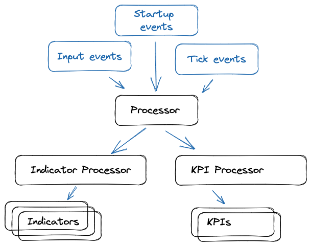

Core processing logic
=======

## Business logic

- The [higher level processor](backend/src/backend/business/processor.py) is responsible to dispatch events to lower level processors
- The [indicator level processor](backend/src/backend/business/indicators/processor.py) is responsible to operations linked to indicators
- The [KPI level processor](backend/src/backend/business/indicators/processor.py) is responsible to operations linked to KPI

These processors are fed with:
- startup events (when the process starts)
- tick events (every minute)
- input events (when something happens, e.g. a log line is detected, ...)

This core business logic has very little knowledge of inputs, indicators and KPIs, thanks to the use of abstract classes. It allows easy extensions (new inputs, indicators or KPIs) without having to touch the core business logic.

## Events

### Tick processing

Every minute, a tick occurs and starts the following processing:
- Indicator processor process the ticket to store indicator transient state or create indicator records and remove the transient states
- KPI processor process the ticket to refresh KPIs values for current aggregations values. New records are created if we changed aggregation period, and old records are removed once expired.
- Indicator processor is called again to purge old indicator records

### Startup processing

At startup, the processor needs to :
- at the indicator level, restore state from DB
- at the KPI level, update KPI values that have to be updated due to the fact that time has passed

### Input processing

Input processing is pretty straightforward: the input is simply fed to all indicators.

## Implementing Indicators and KPIs

Indicators and KPIs are managed in the core logic with abstract classes. They have to be implemented based on the various real use cases that we need to implement.

### Indicators

Real indicators implementations are a subclass of the[Indicator class](backend/src/backend/business/indicators/indicator.py)

Each indicator implementation must have a unique id in the range 1001-1999.

### KPIs

Real KPIs implementations are a subclass of the[KPI class](backend/src/backend/business/kpis/kpi.py)

Each KPI implementation must have a unique id in the range 2001-2999.

